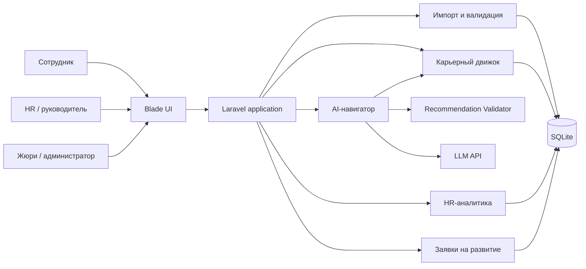
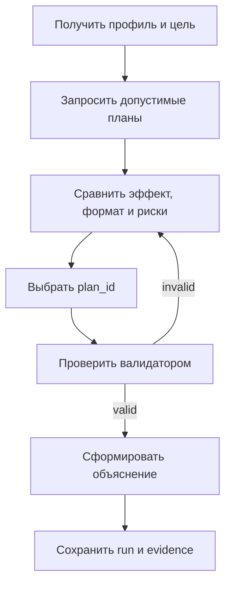
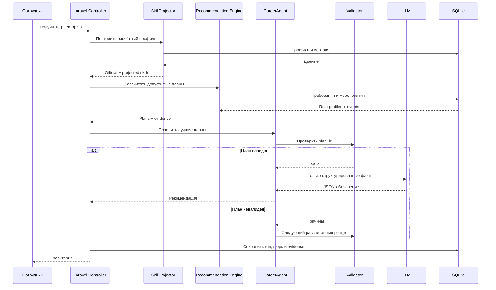

# Career Quest — архитектура

HackAlem AI · трек Halyk Bank · кейс Career Quest.

## 1. Цель системы

Career Quest помогает сотруднику понять, какой шаг развития приблизит его к выбранной роли или следующему грейду. Система:

- рассчитывает актуальное состояние навыков;
- сравнивает его с требованиями карьерной цели;
- строит последовательность из 1–3 допустимых мероприятий;
- объясняет решение фактами из профиля, истории и каталога;
- пересчитывает прогресс после завершения активности;
- показывает HR агрегированные дефициты навыков и пробелы каталога;
- принимает дополнительные проверочные профили в формате стартового датасета.

Геймификация, внутренняя валюта и награды не входят в ядро MVP. Главный результат — корректная, воспроизводимая и объяснимая рекомендация.

## 2. Архитектурное решение

Проект строится как **модульный Laravel-монолит**:

- Laravel 12 и PHP 8.4;
- Blade + Tailwind CSS через Vite;
- SQLite для MVP;
- один deployable artifact;
- одна команда первоначального запуска: `./setup.sh`;
- LLM подключается через адаптер, но не является источником числовых расчётов.

Микросервисы, отдельный Python backend, векторная база и обучение собственной модели для стартового объёма данных не нужны.

Главный принцип:

> PHP рассчитывает допустимые варианты и их эффект. AI сравнивает только проверенные варианты и формулирует понятное объяснение. Валидатор подтверждает результат перед показом пользователю.

## 3. Контекст системы



## 4. Пользователи и ответственность

### 4.1. Сотрудник

Сотрудник:

1. открывает профиль;
2. видит официальный и расчётный уровень навыков;
3. подтверждает или выбирает карьерную цель;
4. получает траекторию из 1–3 шагов;
5. видит ожидаемый прирост и причину выбора;
6. может сравнить шаг с ближайшей альтернативой;
7. может запросить участие в активности;
8. после завершения активности видит обновлённую траекторию.

Система не обещает повышение и не принимает кадровое решение. Она показывает готовность к цели по известным требованиям.

### 4.2. HR

HR использует продукт для управления системой развития, а не для ручного назначения маршрута. HR видит:

- наиболее частые дефициты навыков;
- разрывы по подразделениям, ролям и грейдам;
- сотрудников без карьерной цели или с остановившейся траекторией;
- эффективность мероприятий по статусам `completed`, `no_show`, `dropped`, `declined`;
- критические навыки, для которых в каталоге нет допустимой активности;
- заявки сотрудников на обучение, если реализован P1-поток согласования.

Публичный рейтинг сотрудников не создаётся.

### 4.3. Жюри / администратор

Жюри загружает дополнительный профиль и историю в формате датасета. Они сохраняются в отдельном `import_batch` и проходят тот же алгоритм, что базовые сотрудники. В коде не должно быть условий по известным `employee_id`.

## 5. Исходные данные

| Файл | Назначение |
|---|---|
| `employees.json` | Профили, роли, грейды, цели, навыки и дата последней оценки |
| `skills.json` | 60 навыков и требования для 8 ролей × 4 грейда |
| `events.json` | 40 мероприятий, аудитории, эффекты, prerequisites и даты |
| `activity_history.csv` | 24 месяца истории участия |

Дата расчёта берётся из `meta.as_of_date`. Нельзя использовать системную дату сервера как дату датасета.

Импорт поддерживает:

- полный файл с `meta` и массивом `employees`;
- одиночный профиль из примера ТЗ;
- дополнительный CSV истории;
- повторный запуск без повреждения уже загруженных данных.

При импорте проверяются:

- схема и обязательные поля;
- уникальность идентификаторов;
- диапазон навыков 0–5;
- ссылки на сотрудников, навыки и мероприятия;
- допустимые роли, грейды и статусы;
- даты, `gain` и `max_level`;
- дубликаты истории.

Импорт выполняется в транзакции. При критической ошибке частичные данные не сохраняются.

## 6. Компоненты Laravel

| Компонент | Ответственность |
|---|---|
| `DatasetImporter` | Чтение JSON/CSV, проверка и сохранение import batch |
| `SkillProjector` | Расчёт текущих навыков с учётом завершённых активностей после review |
| `CareerTargetResolver` | Выбор подтверждённой или предлагаемой карьерной цели |
| `SkillGapAnalyzer` | Разрывы между расчётным профилем и требованиями цели |
| `EventEligibilityFilter` | Жёсткая фильтрация недопустимых мероприятий |
| `CompletionEstimator` | Мягкая оценка соответствия формата истории сотрудника |
| `ReadinessCalculator` | Объяснимый индекс готовности к целевому профилю |
| `TrajectoryPlanner` | Симуляция и ранжирование планов из 1–3 шагов |
| `RecommendationValidator` | Независимая проверка результата |
| `CareerAgent` | Оркестрация инструментов и выбор из рассчитанных планов |
| `ExplanationService` | LLM-объяснение и локализация |
| `TemplateExplanationService` | Fallback без внешней AI-модели |
| `ProgressService` | Завершение шага и пересчёт траектории |
| `HrAnalyticsService` | Агрегаты для HR-экрана |
| `DevelopmentRequestService` | Необязательное согласование обучения |

Рекомендуемая структура:

```text
app/
├── Domain/CareerQuest/
│   ├── Data/
│   ├── Enums/
│   ├── ValueObjects/
│   └── Services/
│       ├── SkillProjector.php
│       ├── CareerTargetResolver.php
│       ├── SkillGapAnalyzer.php
│       ├── EventEligibilityFilter.php
│       ├── CompletionEstimator.php
│       ├── ReadinessCalculator.php
│       ├── TrajectoryPlanner.php
│       └── RecommendationValidator.php
├── Application/
│   ├── ImportDatasetAction.php
│   ├── GenerateRecommendationAction.php
│   ├── SimulateTrajectoryAction.php
│   ├── CompleteEventAction.php
│   └── BuildHrDashboardAction.php
├── AI/
│   ├── CareerAgent.php
│   ├── AgentToolbox.php
│   ├── LlmClient.php
│   ├── PromptFactory.php
│   ├── ExplanationService.php
│   └── TemplateExplanationService.php
├── Http/
│   ├── Controllers/
│   ├── Requests/
│   ├── Resources/
│   └── Middleware/
├── Models/
├── Policies/
└── Support/
    ├── DatasetClock.php
    └── AlgorithmVersion.php
```

Правила размещения кода:

- Controller принимает запрос и возвращает View или JSON;
- Form Request проверяет пользовательский ввод;
- Application Action управляет одним пользовательским сценарием;
- Domain Service содержит расчётную логику;
- Eloquent Model не содержит сложного алгоритма рекомендаций;
- AI-модуль не читает БД в обход доменных сервисов.

## 7. Формирование расчётного профиля

Уровни из `employees.skills` отражают состояние на `last_review_date`. Завершённые позже мероприятия ещё не включены в официальную оценку.

Для каждого `completed` после `last_review_date`, по возрастанию даты:

```text
new_level = min(current_level + gain, max_level, 5)
```

Система хранит два представления:

- `official_skills` — уровни из профиля;
- `projected_skills` — расчётное текущее состояние.

Официальные уровни не перезаписываются автоматически. Интерфейс объясняет причину различия.

## 8. Карьерная цель и разрывы

Приоритет цели:

1. цель, подтверждённая пользователем в интерфейсе;
2. `career_goal` из профиля;
3. следующий грейд текущей роли как предварительное предложение.

Если сотрудник уже Lead и цель отсутствует, система предлагает выбрать направление и не выдумывает новую должность.

Для каждого навыка целевого профиля:

```text
gap = max(required_level - projected_level, 0)
```

Начальные веса:

```text
critical skill = 3
other required skill = 1
```

Индекс готовности:

```text
readiness =
  sum(weight × min(current, required) / required)
  / sum(weight)
  × 100
```

Readiness — навигационный показатель, а не решение о повышении.

## 9. Фильтрация мероприятий

До вызова LLM мероприятие исключается, если:

- `mandatory = true`;
- целевая роль или грейд не входят в аудиторию;
- prerequisites не выполнены в текущем состоянии шага;
- мероприятие уже завершено и не является повторяемым;
- мероприятие уже находится в `in_progress`;
- нет будущей сессии и формат не `self_paced`;
- эффект не сокращает ни одного релевантного разрыва;
- текущий уровень уже достиг `max_level` мероприятия.

`EV_036` обрабатывается как разрешённое повторяемое исключение согласно README датасета.

Активности `in_progress` показываются отдельно как «Продолжить», а не теряются.

Для смены профессии допускаются события целевой роли, если они подходят текущему грейду и prerequisites выполнены. Политика должна быть выражена в коде и evidence, чтобы её можно было изменить после уточнения у ментора.

## 10. Учёт истории участия

История влияет на порядок, но не используется как жёсткий запрет. Учитываются:

- `completed`, `dropped`, `no_show`, `declined`;
- тип и формат активности;
- длительность;
- `assigned_by`;
- обратная связь по похожим мероприятиям.

При малом количестве наблюдений используется нейтральное сглаженное значение. Одна неудачная запись не должна навсегда понижать все активности формата.

Критически важное мероприятие не исчезает только из-за пропусков. Агент может выбрать другой формат либо показать его как альтернативу с объяснением риска.

## 11. Скоринг и планирование

Для мероприятия рассчитываются отдельные компоненты:

```text
event_score =
  w1 × readiness_delta
  + w2 × critical_gap_coverage
  + w3 × completion_fit
  + w4 × availability
  + w5 × effort_efficiency
  - w6 × repetition_risk
```

Коэффициенты хранятся в конфигурации и входят в `algorithm_version`.

Эффективный прирост навыка:

```text
effective_gain = min(current + gain, max_level) - current
relevant_gain  = min(gap, effective_gain)
```

Планировщик строит последовательность, а не три независимых курса. После каждого шага он:

1. применяет эффекты;
2. пересчитывает gaps и readiness;
3. повторно проверяет prerequisites;
4. открывает новые мероприятия;
5. учитывает следующую сессию и общую длительность.

Для 40 мероприятий достаточно ограниченного beam search:

```text
maximum depth: 3
beam width: 5
```

При одинаковом score используется стабильная сортировка по `event_id`. Одинаковые входные данные и версия алгоритма должны давать одинаковый базовый план.

## 12. Agentic AI слой

Агент не получает прямой доступ к SQL. Доступны только инструменты Laravel:

| Инструмент | Назначение |
|---|---|
| `get_employee_snapshot` | Обезличенный расчётный профиль |
| `get_target_requirements` | Требования карьерной цели |
| `get_history_summary` | Агрегированная история участия |
| `list_candidate_plans` | Рассчитанные допустимые планы |
| `simulate_plan` | Состояние после выбранной последовательности |
| `compare_plans` | Сравнение двух допустимых вариантов |
| `validate_plan` | Финальная детерминированная проверка |

Цикл агента:



Агент не может:

- придумать новый `event_id`;
- изменить `gain`, `max_level` или prerequisites;
- самостоятельно назначить уровень навыка;
- сохранить рекомендацию без валидатора.

Ответ LLM ограничивается JSON Schema и содержит `selected_plan_id`, объяснение шагов, альтернативу и ограничения. Если LLM не отвечает или возвращает невалидный JSON, используется `TemplateExplanationService`.

## 13. Валидация рекомендации

Перед показом сервер заново проверяет:

- существование мероприятий;
- добровольность;
- аудиторию;
- prerequisites на каждом шаге;
- отсутствие запрещённых повторов;
- `gain`, `max_level` и диапазон 0–5;
- будущие даты;
- readiness до и после;
- соответствие каждого числа сохранённому evidence;
- принадлежность выбранного `plan_id` списку рассчитанных вариантов.

Если лучший план не проходит проверку, берётся следующий. Если допустимых шагов нет, система показывает честный empty state и передаёт catalog gap в HR-аналитику.

## 14. Основной поток запроса



## 15. Модель данных

Для быстрого MVP исходные JSON-поля допустимо хранить как JSON-колонки. Вычислимые запуски и импорт необходимо отделить.

| Таблица | Назначение |
|---|---|
| `import_batches` | Разделяет базовый датасет и проверочные загрузки |
| `skills` | Справочник навыков |
| `role_profiles` | Роль, грейд, requirements и critical skills |
| `employees` | Профиль, цель и официальный снимок навыков |
| `events` | Каталог, аудитория, эффекты, prerequisites и сессии |
| `activity_records` | История участия |
| `recommendation_runs` | Один запуск алгоритма и его версия |
| `recommendation_plans` | Рассмотренные планы и компоненты score |
| `recommendation_steps` | Последовательность выбранного плана |
| `recommendation_evidence` | Факты, на которых основан вывод |
| `development_requests` | Необязательные заявки на обучение |

Минимальный P0 может начать с шести исходных таблиц и `recommendation_runs`. Остальные таблицы добавляются, если evidence и планы неудобно хранить в JSON.

## 16. HTTP-маршруты

### Сотрудник

```http
GET  /employees
GET  /employees/{employee}
POST /employees/{employee}/recommendations
POST /employees/{employee}/simulate
POST /employees/{employee}/complete
PUT  /employees/{employee}/career-goal
```

### HR

```http
GET /hr
GET /hr/skill-gaps
GET /hr/catalog-coverage
GET /hr/event-performance
GET /hr/employees-needing-attention
```

### Импорт

```http
GET  /admin/upload
POST /admin/upload
GET  /admin/imports/{batch}
```

### Заявки на развитие — P1

```http
POST  /employees/{employee}/development-requests
GET   /hr/development-requests
PATCH /hr/development-requests/{request}
```

Самостоятельные бесплатные активности могут открываться без согласования. Платное обучение и активности в рабочее время получают статус `submitted` и решение HR.

## 17. HR-аналитика

Минимальные показатели:

- количество сотрудников без цели;
- число критических разрывов;
- топ дефицитов по подразделениям;
- skills без подходящих добровольных мероприятий;
- completion/no-show/drop rates по событиям и форматам;
- сотрудники с повторными пропусками или давно незавершённой активностью.

Каждый сигнал содержит явную причину. Нельзя показывать непрозрачный «AI-риск» без исходных факторов.

## 18. Роли и приватность

Для демо допустим сессионный переключатель ролей, но проверки выполняются middleware и Laravel Policies на backend.

| Роль | Доступ |
|---|---|
| Employee | Собственный профиль, рекомендация и заявки |
| HR | Агрегаты и разрешённые рабочие профили |
| Admin | Импорт и системные операции |
| Demo/Judge | Временный import batch |

В LLM не передаются ФИО, `manager_id`, прямой идентификатор сотрудника и полная необработанная история. Модель получает роль, цель, gaps, агрегаты истории, варианты планов и evidence.

Названия и описания из импортируемых файлов считаются данными, а не инструкциями. Ответ LLM проверяется по JSON Schema и allowlist допустимых `plan_id`/`event_id`.

## 19. Производительность и устойчивость

| Операция | Целевое время |
|---|---:|
| Обычный интерфейс | до 2 секунд |
| Расчёт профиля, gaps и кандидатов | до 500 мс |
| Построение траектории | до 1 секунды |
| LLM-объяснение | до 8 секунд |
| Полная AI-рекомендация | до 10 секунд |

Рекомендация кэшируется по ключу:

```text
employee_id
+ import_batch_id
+ hash(projected_skills)
+ target
+ hash(relevant_history)
+ algorithm_version
+ language
```

При ошибке или timeout LLM пользователь получает рассчитанный план с шаблонным объяснением. AI не находится в критическом пути корректности.

## 20. Запуск и конфигурация

Ожидаемый запуск:

```bash
./setup.sh
```

Скрипт должен выполнить:

1. `composer install`;
2. создание `.env` из `.env.example`, если его нет;
3. генерацию `APP_KEY`;
4. создание SQLite-файла;
5. миграции;
6. импорт стартового набора;
7. установку frontend-зависимостей и Vite build;
8. запуск приложения либо вывод одной точной команды запуска.

Пример переменных:

```text
DB_CONNECTION=sqlite
LLM_DRIVER=openai_compatible
LLM_BASE_URL=
LLM_API_KEY=
LLM_MODEL=
LLM_TIMEOUT_SECONDS=8
RECOMMENDATION_ALGORITHM_VERSION=career-quest-v1
```

Секреты не коммитятся. В репозитории хранится только `.env.example`.

## 21. Тестирование

### Unit tests

- эффекты `completed` после `last_review_date`;
- хронологическое применение эффектов;
- `gain`, `max_level` и отсутствующий навык = 0;
- расчёт gap и readiness;
- исключение mandatory;
- аудитория и prerequisites;
- запрет повтора completed, кроме `EV_036`;
- отдельное состояние `in_progress`;
- будущие сессии;
- последовательная проверка prerequisites;
- стабильный порядок при одинаковом score.

### Feature tests

- импорт базового датасета;
- импорт одиночного проверочного профиля;
- rollback при ошибке;
- полный recommendation request;
- смена карьерной цели;
- симуляция завершения шага;
- права Employee/HR/Admin;
- fallback при недоступной LLM.

### Golden profiles

1. Самый слабый навык не является критическим для цели.
2. Сотрудник трижды пропускал активности похожего формата.
3. Активность завершена после последней оценки.
4. Нужное мероприятие откроется только после prerequisite-шагa.
5. Критический навык не покрыт каталогом.
6. `career_goal = null`.
7. Цель связана со сменой роли.

Инварианты выбранного плана:

```text
0 <= skill_level <= 5
readiness_after >= readiness_before
каждый шаг допустим в состоянии перед этим шагом
mandatory не является карьерной рекомендацией
каждое число в объяснении существует в evidence
```

## 22. Осознанные ограничения MVP

- Readiness не является кадровым решением.
- Синтетической истории недостаточно для убедительного обучения персональной ML-модели.
- Отсутствие мероприятия показывается как пробел каталога, а не маскируется нерелевантным курсом.
- Предпочтение формата по истории является гипотезой и объясняется пользователю.
- Расширенная геймификация, прогноз увольнения и интеграции не входят в P0.

## 23. Ключевые архитектурные решения

| Решение | Причина |
|---|---|
| Laravel-монолит | Реализуем втроём и запускается одной командой |
| Детерминированное ядро | Проверяемость на неизвестных профилях жюри |
| LLM после фильтрации и симуляции | Меньше галлюцинаций и выдуманных чисел |
| SQLite | Не требует инфраструктуры для демо |
| Import batch | Изоляция проверочных профилей |
| План глубиной до трёх | Соответствует ТЗ и объёму каталога |
| Rule-based completion fit | Данных мало для надёжной ML-модели |
| Template fallback | Демо работает без внешней модели |
| Без публичных рейтингов | Требование ТЗ и защита мотивации |

