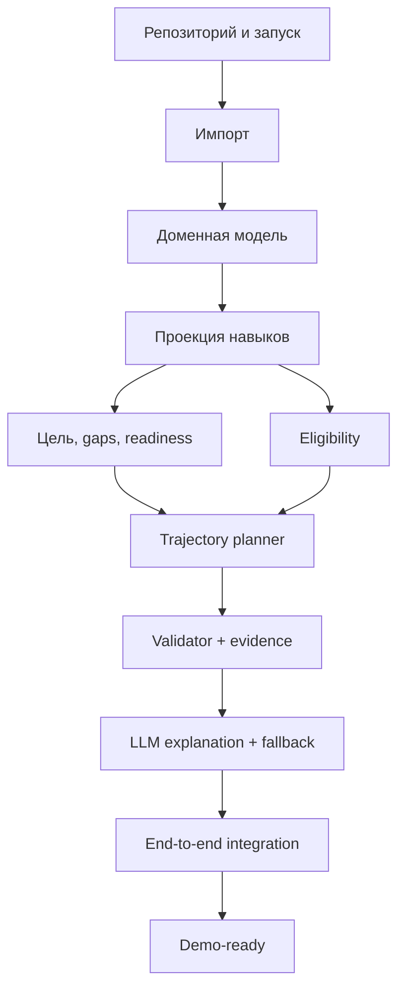

# Career Quest — план проекта

Команда: 3 человека. Формат: однодневный HackAlem AI. Backend: Laravel 12 / PHP 8.4. Frontend: Blade + Tailwind/Vite. Хранилище: SQLite.

## 1. Результат хакатона

К концу разработки новый профиль должен пройти один непрерывный путь:

```text
Импорт
→ валидация
→ расчёт актуальных навыков
→ определение карьерной цели
→ анализ разрывов
→ выбор допустимой траектории
→ серверная проверка
→ понятное объяснение
→ обновление прогресса
→ отражение результата в HR-аналитике
```

Расчёты выполняются PHP-кодом. LLM выбирает только из рассчитанных вариантов и объясняет результат. При недоступной LLM используется шаблонный fallback.

## 2. Приоритеты

### P0 — обязательный MVP

- [ ] Laravel-приложение запускается одной задокументированной командой.
- [ ] Четыре файла стартового датасета импортируются без ручной правки.
- [ ] Дополнительный профиль и история загружаются через UI.
- [ ] Завершённые после `last_review_date` активности учтены в расчётном профиле.
- [ ] Карьерная цель определяется явно; отсутствие цели обработано без выдуманных данных.
- [ ] Для каждого требования показаны текущий уровень, требуемый уровень и gap.
- [ ] Mandatory, недоступные, завершённые и бесполезные события отфильтрованы.
- [ ] Система возвращает последовательность из 1–3 допустимых шагов либо объясняет отсутствие маршрута.
- [ ] Рекомендация учитывает несколько факторов, включая критичность навыка и историю участия.
- [ ] Каждый шаг содержит evidence и ожидаемый прирост.
- [ ] Результат проходит серверный валидатор до показа.
- [ ] После завершения шага пересчитываются навыки, readiness и следующий маршрут.
- [ ] Экран сотрудника показывает профиль, цель, gaps, траекторию и объяснение.
- [ ] HR-экран показывает агрегированные дефициты и пробелы каталога.
- [ ] Employee и HR имеют разные права доступа.
- [ ] При сбое LLM возвращается шаблонное объяснение.
- [ ] Три собственных adversarial fixtures проходят проверку.

### P1 — только после готового P0

- [ ] Сравнение выбранного маршрута с ближайшей альтернативой.
- [ ] Кнопка «Запросить участие» и простой список заявок для HR.
- [ ] Симуляция «Что изменится после прохождения?».
- [ ] Выбор или редактирование карьерной цели.
- [ ] Локализация ключевого сценария на русский и казахский.
- [ ] Фильтры HR по подразделению, роли и грейду.
- [ ] История предыдущих recommendation runs.

### За пределами MVP

- внутренняя валюта и магазин наград;
- публичные рейтинги;
- прогноз увольнения;
- обучение собственной ML-модели;
- полноценный конструктор мероприятий;
- интеграции с календарём и мессенджером;
- мобильное приложение;
- микросервисы.

## 3. Командные треки

### Участник A — Backend / данные

- [ ] Создать Laravel-проект в корне репозитория.
- [ ] Настроить SQLite, `.env.example` и `setup.sh`.
- [ ] Создать миграции для стартовых сущностей и recommendation runs.
- [ ] Создать Eloquent-модели и связи.
- [ ] Реализовать `DatasetImporter` для четырёх файлов.
- [ ] Добавить транзакционную валидацию импортируемых данных.
- [ ] Добавить `import_batch_id` для проверочных загрузок.
- [ ] Реализовать `SkillProjector` с учётом событий после `last_review_date`.
- [ ] Реализовать API/контроллер профиля сотрудника.
- [ ] Реализовать `/admin/upload` для проверочных профилей и истории.
- [ ] Реализовать `ProgressService`: complete → gain/max_level → новая рекомендация.
- [ ] Реализовать базовые HR-агрегации.
- [ ] Добавить middleware и Policies для Employee/HR/Admin.
- [ ] Добавить feature-тесты импорта и прав доступа.
- [ ] Описать запуск в README.

### Участник B — Recommendation / AI

- [ ] Реализовать `CareerTargetResolver`.
- [ ] Реализовать gaps и readiness.
- [ ] Реализовать фильтры mandatory, audience, prerequisites, completed, sessions и max level.
- [ ] Выводить reason codes для включения и исключения кандидатов.
- [ ] Реализовать многофакторный score.
- [ ] Учесть форматы, типы, длительность и статусы истории без жёсткого запрета.
- [ ] Реализовать последовательный planner на 1–3 шага.
- [ ] Пересчитывать prerequisites и gaps после каждого шага.
- [ ] Реализовать `RecommendationValidator`.
- [ ] Сохранять evidence и `algorithm_version`.
- [ ] Реализовать LLM-адаптер со структурированным JSON.
- [ ] Ограничить AI списком допустимых `plan_id`/`event_id`.
- [ ] Реализовать timeout и `TemplateExplanationService`.
- [ ] Добавить unit-тесты доменной логики.
- [ ] Добавить adversarial fixtures из раздела 8.

### Участник C — Frontend / продукт

- [ ] Создать общий Blade layout и навигацию.
- [ ] Добавить переключатель роли для демо.
- [ ] Создать список сотрудников с поиском по роли и грейду.
- [ ] Создать профиль сотрудника.
- [ ] Показать career ladder и выбранную цель.
- [ ] Показать официальный и расчётный уровень навыков.
- [ ] Показать gaps до цели.
- [ ] Добавить кнопку получения рекомендации и loading state.
- [ ] Создать карточки шагов с effect, reason codes и explanation.
- [ ] Добавить alternative/limitations state, если backend их вернул.
- [ ] Реализовать complete-flow с показом дельты.
- [ ] Создать форму загрузки проверочного профиля.
- [ ] Показать ошибки импорта по полям/строкам.
- [ ] Создать HR-дашборд.
- [ ] Добавить empty/error/fallback states.
- [ ] Подготовить демонстрационный сценарий.

## 4. Контракты между треками

Контракты фиксируются на первом часу. Изменение контракта требует обновить этот раздел в том же коммите.

### Получить профиль

```http
GET /employees/{id}
```

```json
{
  "employee": {
    "employee_id": "E0002",
    "role": "Backend Engineer",
    "grade": "Middle",
    "preferred_language": "ru"
  },
  "target": {
    "role": "Backend Engineer",
    "grade": "Senior",
    "confirmed": true
  },
  "readiness": 61,
  "skills": [
    {
      "skill_id": "SK_SYSTEM_DESIGN",
      "official": 1,
      "projected": 2,
      "required": 4,
      "critical": true
    }
  ]
}
```

### Получить рекомендацию

```http
POST /employees/{id}/recommendations
```

```json
{
  "run_id": "run_123",
  "algorithm_version": "career-quest-v1",
  "readiness": {
    "before": 61,
    "after": 79
  },
  "steps": [
    {
      "position": 1,
      "event_id": "EV_005",
      "title": "System Design Fundamentals",
      "duration_hours": 16,
      "skill_changes": [
        {
          "skill_id": "SK_SYSTEM_DESIGN",
          "before": 2,
          "after": 3,
          "required": 4
        }
      ],
      "reason_codes": [
        "CRITICAL_SKILL_GAP",
        "REDUCES_TARGET_GAP"
      ],
      "explanation": "System Design — 2 при требуемых 4 для Senior...",
      "source": "llm"
    }
  ],
  "alternative": null,
  "warnings": []
}
```

`source` принимает `llm` или `fallback`. Числа одинаковы для обоих вариантов.

### Завершить мероприятие

```http
POST /employees/{id}/complete
Content-Type: application/json

{"event_id":"EV_005"}
```

```json
{
  "skill_deltas": [
    {
      "skill_id": "SK_SYSTEM_DESIGN",
      "from": 2,
      "to": 3
    }
  ],
  "readiness": {
    "before": 61,
    "after": 68
  }
}
```

### Импорт проверочных данных

```http
POST /admin/upload
Content-Type: multipart/form-data
```

```json
{
  "batch_id": "batch_test_01",
  "employees_loaded": 3,
  "history_rows_loaded": 26,
  "warnings": [],
  "errors": []
}
```

## 5. Зависимости и критический путь



Frontend начинает работу на mock JSON сразу после фиксации контрактов. LLM не входит в критический путь: до её подключения полный сценарий должен работать с fallback.

## 6. Почасовой план

План использует относительные часы `H0–H12`. При другом фактическом окне сохраняются порядок и контрольные точки.

| Время | A — Backend/Data | B — Recommendation/AI | C — Frontend/Product | Контрольная точка |
|---|---|---|---|---|
| H0–H0:30 | Laravel, SQLite, setup | Правила датасета и DTO | Каркас UX | Проект запускается |
| H0:30–H1 | Схема и импорт | Контракт recommendation response | Mock JSON и layout | Контракты зафиксированы |
| H1–H2 | Парсинг JSON/CSV | Gap/readiness/reason codes | Профиль на mock | Данные читаются |
| H2–H3 | SkillProjector | Eligibility | Цель и gaps | **M1:** профиль корректен |
| H3–H4 | Profile/import endpoints | Ranking | Карточки шагов | Есть recommendation JSON |
| H4–H5 | Import batches | Planner 1–3 шага | Upload UI | Неизвестный профиль загружается |
| H5–H6 | Complete endpoint | Validator/evidence | Complete flow | **M2:** end-to-end без LLM |
| H6–H7 | HR-агрегации | LLM + fallback | HR-экран | Два сценария работают |
| H7–H8 | Интеграционные фиксы | Adversarial fixtures | Интеграционные фиксы | **M3:** hidden-profile ready |
| H8–H9 | Feature tests/RBAC | Unit tests | Error/loading/empty states | Критические тесты зелёные |
| H9–H10 | Производительность | Explainability audit | Адаптация ключевых экранов | Ограничения соблюдаются |
| H10–H11 | Clean setup | README алгоритма | Полировка демо | **M4:** demo-ready |
| H11–H11:30 | Полный прогон | Полный прогон | Полный прогон | Code freeze |
| H11:30–H12 | Только блокеры | Репетиция | Репетиция | Защита готова |

Если к M2 нет полного сценария без LLM, вся P1-работа останавливается до восстановления P0.

## 7. Маркеры интеграции

- [ ] **M0** — `./setup.sh` или документированная эквивалентная команда поднимает приложение.
- [ ] **M1** — импорт работает; профиль учитывает активности после последней оценки.
- [ ] **M2** — backend возвращает валидный план из 1–3 шагов без LLM.
- [ ] **M3** — полный employee flow работает на дополнительном профиле.
- [ ] **M4** — employee + HR + fallback прошли ручной прогон; code freeze.

Маркер отмечается только после фактического совместного прогона.

## 8. Проверочные профили

Неизвестные профили жюри нельзя предсказать, поэтому тестируются общие инварианты.

| ID | Сценарий | Ожидаемое поведение |
|---|---|---|
| HP01 | Public Speaking — минимальный навык; три похожих `no_show`; System Design критичен | Система не выбирает курс только по минимальному уровню; critical gap и история видны в evidence |
| HP02 | После `last_review_date` завершено событие с `gain` | Прирост учтён; `max_level` соблюдён; событие повторно не рекомендуется |
| HP03 | Лучшее событие требует prerequisite | Оно не является первым шагом; подготовительный шаг может открыть его позже |
| HP04 | Почти все подходящие события завершены | Completed исключены; повтор допускается только для `EV_036` |
| HP05 | `career_goal = null` | Цель не объявляется подтверждённой; предлагается следующий грейд или выбор цели |
| HP06 | Критический gap не покрыт каталогом | Честный empty state; HR получает catalog gap |
| HP07 | Переход в другую роль | Gaps считаются по целевой роли; eligibility соответствует выбранной политике |
| HP08 | Подходящий по навыку event обязательный | Mandatory не появляется в добровольной рекомендации |

Дополнительные проверки импорта:

- [ ] Валидный новый профиль добавляется без удаления baseline.
- [ ] Неизвестный `skill_id`, `event_id` или `employee_id` даёт понятную ошибку.
- [ ] Дубликат обрабатывается по явной политике.
- [ ] Отсутствующий необязательный history-файл не ломает импорт профиля.
- [ ] Каждая тестовая запись получает `import_batch_id`.

## 9. Definition of Done

### Функциональность

- [ ] Базовый датасет импортируется без ручной правки.
- [ ] Проверочный профиль загружается через UI.
- [ ] Профиль, цель, gaps и readiness отображаются корректно.
- [ ] Возвращается 1–3 последовательных шага либо объяснимый empty state.
- [ ] Рекомендация опирается минимум на gap и ещё один фактор.
- [ ] Завершение шага меняет расчётный профиль и маршрут.
- [ ] HR видит агрегированные gaps и отсутствие покрытия каталога.

### Корректность

- [ ] Используется `meta.as_of_date`.
- [ ] Учтены completed после `last_review_date`.
- [ ] Соблюдаются `gain`, `max_level` и prerequisites.
- [ ] Mandatory не выдаётся как добровольная рекомендация.
- [ ] Completed не повторяется, кроме `EV_036`.
- [ ] Все числа объяснения существуют в evidence.
- [ ] Все golden profiles проходят.

### Надёжность

- [ ] Обычный интерфейс укладывается в 2 секунды на стартовом наборе.
- [ ] AI-рекомендация укладывается в 10 секунд или завершается fallback.
- [ ] Недоступность LLM не блокирует сценарий.
- [ ] Ошибка импорта не оставляет частичные данные.
- [ ] Empty/loading/error states понятны пользователю.

### Безопасность

- [ ] Employee и HR имеют разные права.
- [ ] Один сотрудник не видит историю другого.
- [ ] В LLM не уходят ненужные ФИО и полная история.
- [ ] API-ключи хранятся только в `.env`.
- [ ] `.env` и секреты отсутствуют в staged diff.
- [ ] Публичного рейтинга сотрудников нет.

### Поставка

- [ ] Проект запускается по README на чистом окружении.
- [ ] Есть `.env.example`.
- [ ] `ARCHITECTURE.md` соответствует реализации.
- [ ] `PLAN.md` содержит актуальные статусы.
- [ ] Полный demo flow пройден после code freeze.

## 10. Риски

| Риск | Ранний сигнал | Митигация | Fallback |
|---|---|---|---|
| Команда уходит в геймификацию | К H3 нет корректного recommendation JSON | P0 freeze | Удалить всю P1-работу |
| Однофакторный ranking | HP01 выбирает минимальный навык | Многофакторный score и reason codes | Явный приоритет critical gaps |
| Ошибка post-review расчёта | HP02 показывает старый уровень | Отдельный SkillProjector | Показать trace расчёта |
| Неожиданная схема профиля | Импорт падает без понятной причины | Поддержать wrapper и single profile | Отчёт ошибок по полям |
| LLM недоступна | Timeout/invalid JSON | 8-секундный timeout и schema validation | Template explanation |
| LLM придумывает числа | Текст не совпадает с evidence | Передавать только готовые факты | Не показывать AI-текст |
| Frontend/backend расходятся | Интеграция начинается после H7 | Контракты в H1 | Backend adapter |
| Merge-конфликты | Два участника меняют один файл | Владение папками, короткие ветки | Один интегратор после M2 |
| Демо не запускается | Есть локальные ручные шаги | Clean setup до H10 | Подготовленное локальное окружение |
| Рекомендация дольше 10 с | Planner/LLM стабильно медленные | Ограничение поиска, eager loading, cache | План без LLM |
| Секрет попадает в Git | `.env` виден в diff | Проверять staged diff | Удалить и перевыпустить ключ |

## 11. Git workflow

Используется короткоживущий trunk-based workflow.

```text
main
feat/data-import
feat/recommendation-engine
feat/employee-ui
feat/hr-dashboard
fix/<short-description>
docs/<short-description>
```

Правила:

- `main` всегда запускается;
- ветка решает одну ограниченную задачу;
- PR содержит что изменено и как проверить;
- критические тесты запускаются до merge;
- после M3 не начинаются новые P1-функции;
- после M4 принимаются только блокирующие исправления;
- force-push в `main` запрещён;
- `.env` не коммитится;
- датасет остаётся в репозитории только в соответствии с правилами организаторов.

Рекомендуемые сообщения:

```text
feat: import career quest dataset
feat: calculate projected skill levels
feat: build employee trajectory view
fix: exclude completed events from recommendations
test: cover post-review skill projection
docs: expand architecture and project plan
```

## 12. Demo script

### 0:00–0:30 — проблема

Показать, что сотрудник получает разрозненные активности и не понимает, какая ведёт к цели.

### 0:30–1:10 — профиль

- роль и грейд;
- карьерная цель;
- readiness;
- critical gaps;
- официальный и расчётный уровень после post-review активности.

### 1:10–2:00 — траектория

- 1–3 последовательных шага;
- какой gap закрывает первый шаг;
- реальный прирост;
- влияние истории;
- причина выбора вместо альтернативы.

### 2:00–2:30 — изменение состояния

Отметить шаг выполненным и показать новый уровень, readiness и следующий шаг.

### 2:30–3:20 — неизвестный профиль

Загрузить adversarial fixture через тот же UI, которым воспользуется жюри, и показать evidence многофакторного решения.

### 3:20–4:00 — HR

Показать top critical gap, количество затронутых сотрудников и навык без подходящего мероприятия.

### 4:00–4:30 — надёжность

Объяснить, что PHP рассчитывает и проверяет решение, AI формулирует объяснение, а fallback сохраняет работоспособность.

## 13. Backlog после MVP

### Следующий релиз

- согласование заявок на повышение квалификации;
- сравнение альтернатив;
- редактирование карьерной цели;
- полная RU/KK-локализация;
- drill-down HR-дашборда;
- история recommendation runs;
- интеграция с LMS.

### После накопления реальных данных

- оценка реального влияния программ развития;
- прогноз вероятности завершения;
- оптимизация бюджета обучения;
- A/B-тестирование формулировок;
- персонализация канала и времени уведомления.

